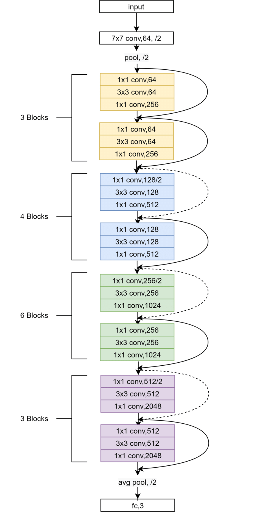

# Cat vs Dog Kaggle using ResNet

## 1. 配置

### 在线配置

在线配置Kaggle, github, 

### 本地配置

本地配置anaconda，pytorch
Kaggle 加入比赛链接：
https://www.kaggle.com/competitions/dogs-vs-cats-redux-kernels-edition

## 2. 提交，熟悉流程

## 3. ResNet论文复现

## 4. 写Train框架

## 5. 训练 & 提交

## 6. 复盘